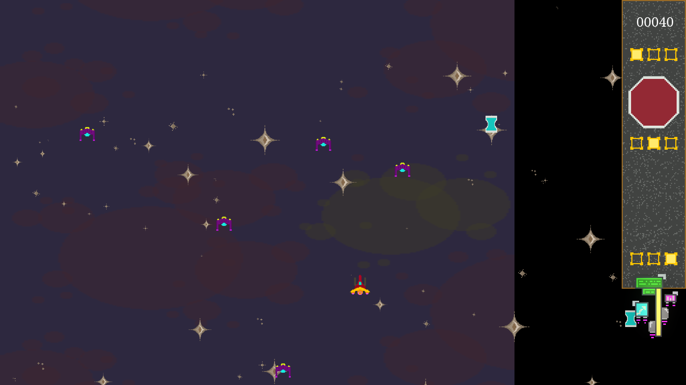

<!--- insert project logo here -->

<!--- general description of the project -->
The game is the computer science graduation project taken at the end of 12th grade in high school. It is based on gameplay inspired by the games Space Invaders and Chicken Invaders.

## :trophy: Features
  &nbsp;&nbsp; :small_orange_diamond: Pickups  
  &nbsp;&nbsp; :small_orange_diamond: Endless gameplay  
  &nbsp;&nbsp; :small_orange_diamond: Hand-drawn pixel animations  
  &nbsp;&nbsp; :small_orange_diamond: Music + sounds

## :hammer: Building
In order to build the project, you need to link it with the precompiled libraries of SFML and Thor.

## :page_facing_up: License
This project is available under the [MIT][ref-mit] license; see [LICENSE](LICENSE) for the full license text.

[ref-mit]:              https://opensource.org/licenses/MIT
